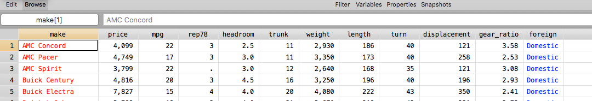

^#^ Working with Data Sets

^#^^#^ Built-in data

Before we turn to using your own data, it is useful to know that Stata comes with a collection of sample data sets which you can use to try the Stata
commands. Additionally, most (if not all) of the examples in [Stata help][stata help] will use these data sets.

To see a list of the built-in data sets, use

~~~~
<<dd_do>>
sysuse dir
<</dd_do>>
~~~~

and use `sysuse` again to load data, for example the `auto` data which contains characteristics of various cars from a 1978 Consumer's Report magazine.

~~~~
<<dd_do>>
sysuse auto
<</dd_do>>
~~~~

If you make any modifications to your data, Stata will try and protect you by refusing to load a new data set which would dispose of your changes. If
you are willing to dispose of your changes, you can either manually do it by calling

```
clear
```

or passing it as an option to `sysuse`,

~~~~
<<dd_do>>
sysuse auto, clear
<</dd_do>>
~~~~

^#^^#^^#^ Stata Website Data

In addition to the data sets distributed with Stata, Stata also makes available a large collection of data sets on their website which can be accessed
with the `webuse` command. These data sets are used as examples in the Manual and can be seen listed
as [http://www.stata-press.com/data/r16/](http://www.stata-press.com/data/r16/).

~~~~
<<dd_do>>
webuse hiway
<</dd_do>>
~~~~

`webuse` supports the `clear` option as well.

The exercises in this workshop will be using mostly built-in data sets as it makes distribution easy!

^#^^#^ Opening data

As you may have deduced from the `sysuse` and `webuse` commands above, the command to load local data is `use`:

```
use <filename>
```

As discussed in the [working directory][working directory] section, Stata can see only files in its working directory, so only the name of the file
needs to be passed. If the file exists in a different directory, you will need to give the full (or relative path). For example, if your working
directory is "C\:\\\Documents\\\Stata" and the file you are looking for, "mydata", is in the "Project" subfolder, you could open it with any of the
following:

```
use C:\Documents\Stata\Project\mydata
use Project\mydata
cd Project
use mydata
```

Note that if the path (or file name) contains any spaces, you need to wrap the entire thing in quotes:

```
use "C:\Documents\Stata\My Project\My Data"
```

It is never wrong to use quotes (just not always required), so perhaps that's a safer option.

If the location of your file is much different than your working directory, it can be quicker just to use the menu "File -> Open" and use the file
open dialog box instead. As with all commands, the `use` command will be echoed in the Results after using the dialog box, allowing you to add it to a
Do-file.

As with `sysuse` and `webuse`, the `clear` option discards the existing data regardless of unsaved changes.

^#^^#^^#^ Loading subsets of the data

You can load only a subset of the data into the program at a time. Generally I would recommend loading the full data and then [discarding][discarding
data] the extraneous information. However, if your data is very large, it might be handy to only load in some of it rather than the entire thing. As
this is a lesser-used option we won't go into too much detail, but as an example, if I wanted to load only the variables named "bp", "heartrate" and
"date" from the data set "patientdata", restricted to male patients, I might use something like

```
use bp heartrate date if gender == "male" using patientdata
```

Here, `using` and `if` are subcommands, which we will see used more as the day goes on.

Alternatively, if you have a very large data set, you can load in a small chunk of it.

```
use patientdata in 1/100
```

This loads just the first 100 rows (`a/b` is a "numlist" counting from "a" to "b" by integers).

For further details, see `help use`, specifically the manual which has the full documentation.

^#^^#^ Editing data manually

We will discuss in [Data Manipulation][data manipulation] how to edit your data on a larger scale and in an automated fashion, but Stata does
support modifying a spreadsheet of your data similar to Excel. At the top of the main window, you'll see two buttons, "Data Editor" and "Data
Browser". These open the same new Data window, the only difference is that Stata is protecting you from yourself and if you open the "Data Browser"
(or switch to it in the Data window), you cannot modify the data.

Once in the Data window, you can select cells and edit them as desired.

^#^^#^^#^ Colors as variable type

When viewing the data, the color of each column's text provides information about the type of variable. We'll go into more details [later][describing
the data] what these types mean. Below, for the `auto` data, you can see the `make` variable is red, indicating a string, the `foreign` variable is
blue indicating a variable with an attached [value label][labeling values] and the remainder of the variables are black for numeric.

[](../images/datacolors.png)


^#^^#^ Saving data

Saving data is straightforward using the `save` command. If you do not pass a filename to `save`, it will save with the same name as the existing
data. If you pass a name, e.g. `save mydata2`, it will save a copy in the working directory. You can pass it a full path just like with `use` to refer
to a location outside of the working directory.

By default, `save` will not overwrite existing files. To do so, use the `replace` option.

```
save newfile // Saves a new copy with a new name, failing it "newfile" already exists.
save, replace // Replaces the existing copy with the same name
save newfile, replace // Replaces the new name copy.
```

I recommened **never** using the first two options (without the file name) to avoid accidents.

As before, wrap the file name in quotes if it (or the path) includes any spaces.

Prior to Stata 14, the save format was different. If you need to save a data set in the older format (perhaps to pass to a collaborator who is
woefully behind the times), check `help saveold`.

^#^^#^ Importing data

The need often arises to import data from another format (such as Excel or SPSS). Stata has a suite of very useful commands for importing data sets
having other formats. To see the types of data that Stata can import, select "File -> Import".

While there are commands to do the importing (such as `import excel file.xlsx`), the dialog boxes for importation provide a preview of the imported
data, making it easier to ensure that the importation will go smoothly.

^#^^#^^#^ Importing Excel data

Data stored in Excel can be ported into Stata easily. To make your life easier, make sure the data adheres to these general principals. While
technically none of these are "required", ignoring them will lead to a lot more work down the road!

- Remove extraneous information (plots, notes, data dictionaries, summary statistics).
- Remove "fancy" formatting - merged cells, empty rows/columns.
- Ensure each column is of one "type" - if the column is supposed to be numbers, don't include any words!
- Make missing values blank (unless you are interested in types of missingness, in which case be sure to have a coherent coding scheme).

Once you have cleaned your data, you can choose "File -> Import -> Excel Spreadsheet (*.xls, *.xlsx)". The next dialog allows you to tweak the
options. Important options include

- *Worksheet*: Make sure you are importing the correct sheet!
- *Cell range*: If you have extraneous information in your spreadsheet, you can exclude it here. (Though in my experience it is better to remove the
  extraneous data from Excel, as its easy to forget something here!)
- *Import first row as variable names*: In Excel, it is common to have the first row being the variable names with the second row starting
  the data. In Stata, the variable names have their own special field, so only data should exist in the data. Check this to ensure the variables are
  properly named.
- *Import all data as strings*: It should rarely be useful to use this.

Stata reads all the data and tries to predict whether each column represents a number or a string. To do so, it goes through some logic.

1. Is anything in the column non-numeric? If yes, it is a String. If no, continue.
2. Is anything in the column formatted as a Date or Time? If yes, it is a Date or Time. If no, continue.
3. It is a number.

If Stata makes mistakes here (usually because the data is formatted oddly), things can go wrong. The last option, "Import all data as strings" can be
used to force Stata to treat everything as a string so that it reads in the data *exactly* as stored in the Excel sheet so that you can clean it up
later. Note that cleaning this up is usually more complicated then just fixing the Excel sheet first! (Note also that for larger data, this scan can
be slow!)

Once the preview looks accurate, go ahead and import. As usual, this will create an `import excel` command in the Results that you can save for the
future in a Do-file, but using `save` to create a Stata data set to load in later is probably a better option.

^#^^#^^#^ Importing a CSV File

CSV files (comma separated values) are a very useful format for passing data between software. Files specific for software (e.g. .dta for Stata, .xlsx
for Excel, .sav for SPSS) carry a lot of overhead information - very useful when working exclusively within that software, but confusing for other
software. The import menu in Stata (and other software) can often address this, but a CSV file bypasses this. Data in CSV format might look like

```
id,salary,exprior,market,admin,yearsdg,rank,male
1,38361.75,0,.72,0,14,2,0
2,68906,2,1,,31,3,1
```

The first row is the variable names, all separated by commas. The 2nd row starts the data, where each variable is again separated by commas. Multiple
commas in a row indicate a missing value.

The downside of CSV files is we lose any auxiliary information, such as descriptive titles, labels etc. Often, if you are obtaining CSV files from an
online resource, they will provide a Do-file alongside the data that reads in the CSV file and applies labels, titles, etc. If not you'll have to do
this yourself!

A CSV files can be imported using "File -> Import -> Text Data (delimited, *.csv, ...)"

Important options include:

- *Delimiter* - There are other \_SV types of files, such as tab or white space. Generally you can leave this at Automatic, but may need to be precise
  if your data has a lot of strings in it.
- *Treat sequential delimiters as one* - If you have missing data, it will appear as `5,4,,2,1`. If this option is **not** selected, Stata will
  recognize the missing third entry. On the other hand, if your deliminator is white space, you may have data like `3 1    2 5`. If you
  want that to be four variables instead of a bunch of other missing entries, select this option.
- *Use first row for variable names* - Same as the Excel version.

^#^^#^^#^ Importing from a file not supported directly by Stata

If you have data in a format not supported by Stata, there are three options:

First, try opening the the data in a word processor and see if it is delimited instead of more complicated (e.g. a CSV file with a different file
extension). This is a long shot, but the easiest! If you open it in something like Word, make sure you don't save it in .doc format! Instead, rename
the file ".txt" or ".csv" and try importing it as that.

Second, see if the software which created the data can write it into Stata (.dta) format. Some software such as R supports this, though some software
(such as SPSS) only supports writing to older versions of Stata. You can still try this, though be sure to double check that nothing went wrong, and
re-save your data (which saves it as the new save format).

Finally, see if you can open the data in the other software and export it into CSV or a similar common format.

If all else fails, there is software Stat Transfer, https://www.stattransfer.com, which can transfer between all sorts of formats with a click, but is
not free. Your department or organization may offer access to it.

^#^^#^ Temporarily preserving and restoring data

Along with the [one data][one data] principal, if you wished to modify a data set temporarily, say to [remove][discarding data] some subset of your
observations, it must be done destructively. One workflow to use would be:

```
sysuse auto
<modify data set as desired>
save tmp
<subset data>
<obtain results>
use tmp, clear
<delete the tmp file manually>
```

Alternatively, the `preserve` and `restore` commands perform the same set of operations in a more automated fashion:

```
sysuse auto
<modify data set as desired>
preserve
<subset data>
<obtain results>
restore
```

The `preserve` command saves an image of the data as they are now, and the `restore` command reloads the image of the data, discarding any interim
changes. There can only be a single image of the data preserved at a time, so if you `preserve`, then make a change and want to `preserve` again
(without an intervening `restore`), you can pass the option `not` to `restore` to discard the preserved image of the data.

```
restore, not
```

^#^^#^ Exercise 1

1. Load the [built-in][built-in data] data set "lifeexp".
2. Open the Data Editor window. [Modify][editing data manually] at least one of the cells.
3. Close the Data window. Load the built-in data set "sandstone". Don't forget to `clear` or pass the `clear` option.
4. [Save a copy][saving data] of this data to your computer.
    1. Check your [working directory][working directory]. Make sure it is set somewhere convenient.
    2. Use `save`. Make sure to give it a name!
5. If you haven't already, play with [`preserve` and `restore`][Temporarily preserving and restoring data]. Preserve the data, modify some values,
   then observe what happens when you restore.
